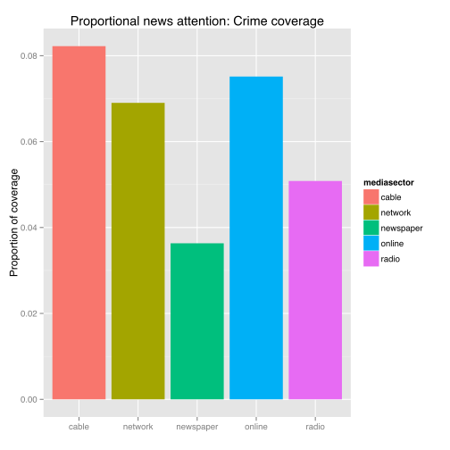
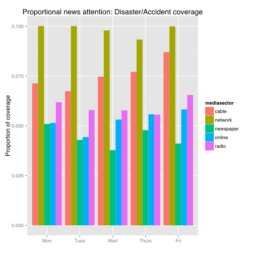
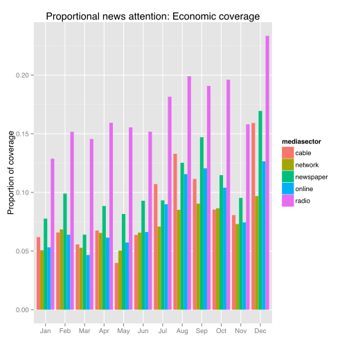
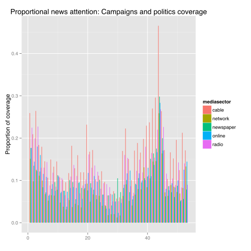

Title: Simple plots using date data
Slug: date-plots-in-R
Category: walkthroughs
<!-- Status: draft -->
Date: 2014-04-25 15:30

Anyone who has worked with timestamped data will tell you: dates are hard.  The only reason we can use dates as a unit for analysis is because all of us silly humans agreed to honor a calendar system.  

We all agree that time exists; planets rotate in a reliable fashion and the expansion of space can be measured in units of time.  But time (and by extension, dates) are denoted in units that humans can understand, and those units are agreed upon by convention and committee.  

## Calendar time versus system time

How does your computer keep track of time (also called _system time_)?  Back in ye olden days, the creation of a clock was an incredible feat of engineering and design.  We first tracked time using methods with terrible fidelity, such shadows cast by objects or the flow of water, working our way up towards increasing temporal resolution with mechanical designs that relied upon springs, gears, pendulums, and other materials that obeyed the physical laws of the universe. 

Most modern methods of keeping track of time are now contingent on electronics that are more reliable than those earlier mechanical methods.  Computers are particularly good at keeping track of the passage of time, since at a certain level, it's basically just a tally that increments at an interval determined by digital signals (a very predictable signal).  

## Why should I care about epochs?

But the only way you can use that tally to determine _date_ the way we humans understand time is if as long as you have a reference point to compare your tally against. For most computers, that's the __Unix epoch__ (if you are on a Windows machine, you probably are using a different value).

If you've ever seen a tutorial that talked about date types before, you might have seen this phrase.  More importantly, if you've ever used a reasonably well-designed date format library before, you'll probably notice that a lot of the functions try to force you to convert time to UTC or "Coordinated Universal Time."  

System time is typically measured in seconds from the epoch, and well-written libraries can convert system time to calendar time.  You can [follow this link](http://www.epochconverter.com/) if you want to see what current calendar time is in Unix epoch time.  

## But no, seriously, should I care about epoch time?

Yes, you should know what Unix epoch time is.  But generally, you can't really count on someone being so forward thinking as to record all their dates in Unix epoch time, or even to be so smart as to keep their human-readable dates and times in UTC and in a reliable machine-readable format.  For example, how many ways can you think of writing out January 1st, 2000?

1. 01/01/2000 (For you Americans)
2. 01/01/2000 (For you Canadians)
3. 01-01-2000
4. Jan 1 2000
5. Jan 01, 2000
6. 01 Jan 2000
7. 01 Jan 2000 00:00:00 PST

And so on.  Maybe you're even so unlucky that someone has _changed the date format on you mid-file_ (by the way, if you have done this, one I will find you and I _will_ make you suffer).

## And now that you know a little bit about time, let's get to the point of this post: the tutorial

In this post, I'm going to go through a very simple example of working with date data in `R`.  I have a bunch of data that is timestamped.  The timestamps are in human-readable strings denoting a date in human-readable calendar time.  I want to use these timestamps ordered by calendar time so that I can look at my data in a way that is meaningful to humans.  

I'm going to use a few handy `R` libraries: `ggplot`, `reshape2`, `plyr`, and most importantly, `lubridate`.

## The data we'll be using
The Pew Center's Project for Excellence in Journalism has a project called the News Coverage Index.  This is an on-going research study where they keep track of news coverage over a bunch of outlets and across an array of media sectors: broadcast, network, newspaper, online, and radio news.  They have been counting various attributes of news coverage practically every day for years.  They also do some coding of the data, so you can roughly categorize news coverage by topics.

I have one caveat, which is that this is sample data. You really can't read too much into the meaning of the differences, because the sampling of this data means that they aren't getting _all_ of the news.  To their credit, they clearly acknowledge this shortcoming, so we'll just treat this as interesting data that happens to be timestamped.

You have to sign an agreement in order to get the data, so I won't distribute it here.  But it's easy enough to get as long as you agree to their conditions.  In this post, I'm using the data from 2010, 2011, and the 2012 release (which only covers January to May).

## The code!

I'm an acolyte of the Church of Wickham, so you'll see quite a bit of dependency on his packages.  I won't apologize.  He's directly contributing to the increasing value of `R`.  

I'll load all the libraries here:

```r
library(foreign)
library(reshape2)  # Wickham
library(ggplot2)  # Wickham
library(plyr)  # Wickham
library(lubridate)  # Wickham
library(car)
```


I'm using the `foreign` package because the Pew data comes as `.sav` files.  This package has a function `read.spss` that allows you to work with SPSS files in `R`.  You can also use `spss.get` in the `Hmisc` package; nobody is going to stop you.  I prefer the semantic continuity of `read.spss` with the other `read` functions in `R`, which is basically the only reason I use it over `spss.get`. 


```r
setwd("/Users/rweiss/Dropbox/research/projects/NewsCoverage/")  # my working directory
data2012 = read.spss("NCI/Jan - May 2012 data TO BE RELEASED.sav", to.data.frame = T)
data2011 = read.spss("NCI/Jan1-Dec31 2011.sav", to.data.frame = T)
data2010 = read.spss("NCI/Jan 1-Dec 31 2010 for release.sav", to.data.frame = T)
```


Note that I included `to.data.frame=T` as an argument to the `read.spss` function, otherwise `data2012`, `data2011`, and `data2010` are returned as list objects, and I prefer to work with data.frames. 

What exactly are the dimensions of these data.frames?


```r
names(data2012)
```

```
##  [1] "StoryDate"           "StoryID"             "Source"             
##  [4] "BroadcastStartTime"  "durasec"             "StoryWordCount"     
##  [7] "PlacementProminence" "storyformat"         "BigStory"           
## [10] "GeographicFocus"     "topicgrouped"        "LeadNewsmaker"      
## [13] "LeadNewsmaker2"      "mediasector"
```


And what are the types of these dimensions?


```r
sapply(data2012, class)
```

```
##           StoryDate             StoryID              Source 
##           "numeric"           "numeric"            "factor" 
##  BroadcastStartTime             durasec      StoryWordCount 
##            "factor"           "numeric"           "numeric" 
## PlacementProminence         storyformat            BigStory 
##            "factor"            "factor"           "numeric" 
##     GeographicFocus        topicgrouped       LeadNewsmaker 
##            "factor"            "factor"            "factor" 
##      LeadNewsmaker2         mediasector 
##            "factor"            "factor"
```

I don't really care about most of these dimensions.  Also, there's an additional annoying detail, in that 2010 and 2011 don't have the same variable labels as 2012.  

First, let's drop all the dimensions I don't care about.


```r
data2012_small = subset(data2012, select = c("StoryDate", "StoryID", "Source", 
    "mediasector", "topicgrouped", "BroadcastStartTime"))
data2011_small = subset(data2011, select = c("StoryDate", "StoryID", "Source", 
    "mediasector", "broadstorytopic", "BroadcastStartTime"))
data2010_small = subset(data2010, select = c("StoryDate", "StoryID", "Source", 
    "mediasector", "broadstorytopic", "BroadcastStartTime"))
```


I'll relabel all of the dimensions with the same names, because who wants to retype all those labels again?


```r
labels = names(data2012_small)
names(data2011_small) = labels
names(data2010_small) = labels
```


Now that they have the same labels for their dimensions, I can now create one big data.frame with all three years:


```r
data = rbind(data2012_small, data2011_small, data2010_small)
```


Another detail: the levels of a couple of the variables are not the same between the years.  I am a habitual abuser of the `recode` function in `car`, but there are loads of ways to have solved this problem.


```r
data$mediasector = car::recode(data$mediasector, "'network TV'='network'; 'cable TV'='cable'")
data$topicgrouped = car::recode(data$topicgrouped, "'U.S. miscellaenous'='U.S. miscellaneous'; 'Economy/Economics'='economy/economics'")
```


FYI, I discovered this inconsistency in levels when I was plotting out my code.  But you could also do something like this:


```r
sapply(data2012_small, levels) %in% sapply(data2011_small, levels)
```

```
## [1]  TRUE  TRUE FALSE  TRUE  TRUE  TRUE
```


Heck, you could even put this in a table to see which years don't match:


```r
table(names(data), sapply(data2012_small, levels) %in% sapply(data2011_small, 
    levels))
```

```
##                     
##                      FALSE TRUE
##   BroadcastStartTime     0    1
##   mediasector            0    1
##   Source                 1    0
##   StoryDate              0    1
##   StoryID                0    1
##   topicgrouped           0    1
```


You'd have to mix and match the years, but you can hopefully see that there's already a mismatch in the levels of the `Source` dimension between 2012 and 2011. 

### Dates and `lubridate`
The dates in this data are just strings.  Take a look at the `StoryDate` dimension:

```r
head(data)
```

```
##   StoryDate StoryID   Source mediasector                 topicgrouped
## 1  20120102  430675 NY Times   newspaper campaigns/elections/politics
## 2  20120102  430676 NY Times   newspaper campaigns/elections/politics
## 3  20120102  430677 NY Times   newspaper           foreign (non U.S.)
## 4  20120102  430684 NY Times   newspaper  defense/military (domestic)
## 5  20120102  430685 NY Times   newspaper         U.S. foreign affairs
## 6  20120102  430686 NY Times   newspaper                        crime
##   BroadcastStartTime
## 1      not broadcast
## 2      not broadcast
## 3      not broadcast
## 4      not broadcast
## 5      not broadcast
## 6      not broadcast
```


I'm curious to see what the relative proportion of coverage per topic is over various time dimensions: day of the week, per month, and per week in the year.  To do this, I first need to compute the proportion of topic coverage per day:


```r
data_prop = ddply(data, .(StoryDate, mediasector, BroadcastStartTime), function(x) {
    prop.table(table(x$topicgrouped))
})
head(data_prop)
```

```
##   StoryDate mediasector           BroadcastStartTime
## 1  20100101       cable afternoon program (noon-5pm)
## 2  20100101       cable   evening program (5pm-11pm)
## 3  20100101     network   morning program (5am-noon)
## 4  20100101     network   evening program (5pm-11pm)
## 5  20100101   newspaper                not broadcast
## 6  20100101      online                not broadcast
##   additional domestic affairs business campaigns/elections/politics
## 1                     0.10000  0.10000                      0.00000
## 2                     0.03571  0.03571                      0.03571
## 3                     0.00000  0.00000                      0.04348
## 4                     0.00000  0.06250                      0.00000
## 5                     0.10000  0.10000                      0.10000
## 6                     0.00000  0.06667                      0.03333
##   celebrity/entertainment court/legal system crime
## 1                 0.00000                  0   0.1
## 2                 0.00000                  0   0.0
## 3                 0.00000                  0   0.0
## 4                 0.03125                  0   0.0
## 5                 0.00000                  0   0.0
## 6                 0.00000                  0   0.0
##   defense/military (domestic) development/sprawl disasters/accidents
## 1                         0.1                  0             0.00000
## 2                         0.0                  0             0.03571
## 3                         0.0                  0             0.00000
## 4                         0.0                  0             0.00000
## 5                         0.0                  0             0.00000
## 6                         0.0                  0             0.00000
##   domestic terrorism economy/economics education environment
## 1            0.00000           0.00000   0.00000     0.00000
## 2            0.03571           0.03571   0.00000     0.03571
## 3            0.08696           0.17391   0.00000     0.00000
## 4            0.09375           0.00000   0.00000     0.00000
## 5            0.20000           0.20000   0.00000     0.00000
## 6            0.06667           0.03333   0.03333     0.06667
##   foreign (non U.S.) government agencies/legislatures health/medicine
## 1            0.00000                          0.00000         0.00000
## 2            0.03571                          0.21429         0.10714
## 3            0.00000                          0.04348         0.04348
## 4            0.12500                          0.21875         0.00000
## 5            0.00000                          0.00000         0.10000
## 6            0.13333                          0.03333         0.03333
##   immigration lifestyle   media race/gender/gay issues religion
## 1           0   0.00000 0.10000                0.00000        0
## 2           0   0.00000 0.07143                0.03571        0
## 3           0   0.04348 0.08696                0.04348        0
## 4           0   0.06250 0.03125                0.00000        0
## 5           0   0.00000 0.00000                0.00000        0
## 6           0   0.06667 0.00000                0.00000        0
##   science and technology sports transportation U.S. foreign affairs
## 1                0.00000 0.0000        0.00000               0.5000
## 2                0.10714 0.0000        0.07143               0.1071
## 3                0.00000 0.0000        0.00000               0.1304
## 4                0.03125 0.0625        0.00000               0.1875
## 5                0.00000 0.0000        0.10000               0.1000
## 6                0.00000 0.0000        0.00000               0.3333
##   U.S. miscellaneous
## 1            0.00000
## 2            0.00000
## 3            0.30435
## 4            0.09375
## 5            0.00000
## 6            0.10000
```


To verify, let's make sure everything sums to 1 per day, by media sector, and per broadcast time:

```r
topics = levels(data$topicgrouped)
proportion_check = ddply(data_prop, .(mediasector, StoryDate, BroadcastStartTime), 
    function(x) {
        rowSums(x[, which(names(x) %in% topics)])
    })
summary(proportion_check$V1)
```

```
##    Min. 1st Qu.  Median    Mean 3rd Qu.    Max. 
##       1       1       1       1       1       1
```


Here comes the date challenge.  `StoryDate` is just a string.  It doesn't contain the inherent meaningful nature of calendar dates as we humans recognize dates to have.  

Most programming languages have developed various utilities to help with handling dates as data types.  In `R`, we have the `lubridate` package.  

Normally, you'd have to do something with date expressions and `strptime` in order to convert a string to a date (or `strftime` if you wanted to convert from date to string).  This is a completely acceptable solution, and everyone should probably spend some time working through those functions in order to get a better sense of how computers work with simple date and time expressions.

On the other hand, `lubridate` comes with a variety of functions that make it really easy to extract calendar date information from objects like strings.  Going further, it has a bunch of handy functions to work with abstractions of calendar concepts that we humans care about; for example, day of the week, month, and week of the year.  


```r
data_prop$StoryDate = ymd(data_prop$StoryDate)
data_prop$month = month(data_prop$StoryDate, label = TRUE, abbr = TRUE)
data_prop$week = week(data_prop$StoryDate)
data_prop$wday = wday(data_prop$StoryDate, label = TRUE, abbr = TRUE)
```


And that is basically it, friends.  Here's what that looks like:


```r
head(data_prop)
```

```
##    StoryDate mediasector           BroadcastStartTime
## 1 2010-01-01       cable afternoon program (noon-5pm)
## 2 2010-01-01       cable   evening program (5pm-11pm)
## 3 2010-01-01     network   morning program (5am-noon)
## 4 2010-01-01     network   evening program (5pm-11pm)
## 5 2010-01-01   newspaper                not broadcast
## 6 2010-01-01      online                not broadcast
##   additional domestic affairs business campaigns/elections/politics
## 1                     0.10000  0.10000                      0.00000
## 2                     0.03571  0.03571                      0.03571
## 3                     0.00000  0.00000                      0.04348
## 4                     0.00000  0.06250                      0.00000
## 5                     0.10000  0.10000                      0.10000
## 6                     0.00000  0.06667                      0.03333
##   celebrity/entertainment court/legal system crime
## 1                 0.00000                  0   0.1
## 2                 0.00000                  0   0.0
## 3                 0.00000                  0   0.0
## 4                 0.03125                  0   0.0
## 5                 0.00000                  0   0.0
## 6                 0.00000                  0   0.0
##   defense/military (domestic) development/sprawl disasters/accidents
## 1                         0.1                  0             0.00000
## 2                         0.0                  0             0.03571
## 3                         0.0                  0             0.00000
## 4                         0.0                  0             0.00000
## 5                         0.0                  0             0.00000
## 6                         0.0                  0             0.00000
##   domestic terrorism economy/economics education environment
## 1            0.00000           0.00000   0.00000     0.00000
## 2            0.03571           0.03571   0.00000     0.03571
## 3            0.08696           0.17391   0.00000     0.00000
## 4            0.09375           0.00000   0.00000     0.00000
## 5            0.20000           0.20000   0.00000     0.00000
## 6            0.06667           0.03333   0.03333     0.06667
##   foreign (non U.S.) government agencies/legislatures health/medicine
## 1            0.00000                          0.00000         0.00000
## 2            0.03571                          0.21429         0.10714
## 3            0.00000                          0.04348         0.04348
## 4            0.12500                          0.21875         0.00000
## 5            0.00000                          0.00000         0.10000
## 6            0.13333                          0.03333         0.03333
##   immigration lifestyle   media race/gender/gay issues religion
## 1           0   0.00000 0.10000                0.00000        0
## 2           0   0.00000 0.07143                0.03571        0
## 3           0   0.04348 0.08696                0.04348        0
## 4           0   0.06250 0.03125                0.00000        0
## 5           0   0.00000 0.00000                0.00000        0
## 6           0   0.06667 0.00000                0.00000        0
##   science and technology sports transportation U.S. foreign affairs
## 1                0.00000 0.0000        0.00000               0.5000
## 2                0.10714 0.0000        0.07143               0.1071
## 3                0.00000 0.0000        0.00000               0.1304
## 4                0.03125 0.0625        0.00000               0.1875
## 5                0.00000 0.0000        0.10000               0.1000
## 6                0.00000 0.0000        0.00000               0.3333
##   U.S. miscellaneous month week wday
## 1            0.00000   Jan    1  Fri
## 2            0.00000   Jan    1  Fri
## 3            0.30435   Jan    1  Fri
## 4            0.09375   Jan    1  Fri
## 5            0.00000   Jan    1  Fri
## 6            0.10000   Jan    1  Fri
```


Again, I'm a practitioner of the Hadley school of R, so I rely heavily on his approach to processing data.  Before I move into plotting, I'm going to take this _wide_ data (lots of dimensions) and convert it to a _long_ form of data, where I have some variables that will be useful as a dimensional mapping in the eventual plot, and some variables that will serve as the actual measured values.

I'll create a variety of separate data.frames that will be used solely for each of these time units, just to illustrate some examples of how these pieces can fit together. 


```r
# Melt data from wide to long
melted_data = melt(data_prop, id.vars = c("StoryDate", "mediasector", "wday", 
    "month", "week", "BroadcastStartTime"))

# Pew only gathered newspapers on Sunday, so let's ignore for now
melted_data = melted_data[melted_data$wday != "Sun", ]

# Average down to the weekday

melted_data_total = ddply(melted_data, .(variable, mediasector), summarise, 
    value = mean(as.numeric(value), na.rm = T))

melted_data_wday = ddply(melted_data, .(wday, variable, mediasector), summarise, 
    value = mean(as.numeric(value), na.rm = T))

melted_data_week = ddply(melted_data, .(week, variable, mediasector), summarise, 
    value = mean(as.numeric(value), na.rm = T))

melted_data_month = ddply(melted_data, .(month, variable, mediasector), summarise, 
    value = mean(as.numeric(value), na.rm = T))
```


### What's the proportion of news coverage related to crime by media sector?

```r
ggplot(melted_data_total[melted_data_total$variable %in% "crime", ], aes(x = mediasector, 
    y = value, fill = mediasector)) + geom_histogram(stat = "identity", position = "dodge") + 
    # coord_flip() +
ggtitle("Proportional news attention: Crime coverage") + xlab("") + ylab("Proportion of coverage")
```

 


### Does the day of the week relate to proportion of disaster coverage?

```r
ggplot(melted_data_wday[melted_data_wday$variable %in% "disasters/accidents", 
    ], aes(x = wday, y = value, fill = mediasector)) + geom_histogram(stat = "identity", 
    position = "dodge") + ggtitle("Proportional news attention: Disaster/Accident coverage") + 
    xlab("") + ylab("Proportion of coverage")
```

 


### Do we see more economic coverage in some months over others?

```r
ggplot(melted_data_month[melted_data_month$variable %in% "economy/economics", 
    ], aes(x = month, y = value, fill = mediasector)) + geom_histogram(stat = "identity", 
    position = "dodge") + ggtitle("Proportional news attention: Economic coverage") + 
    xlab("") + ylab("Proportion of coverage")
```

 


### Behold!  The electoral horse race news coverage by week of the year.

```r
ggplot(melted_data_week[melted_data_week$variable %in% "campaigns/elections/politics", 
    ], aes(x = week, y = value, fill = mediasector)) + geom_histogram(stat = "identity", 
    position = "dodge") + ggtitle("Proportional news attention: Campaigns and politics coverage") + 
    xlab("") + ylab("Proportion of coverage")
```

 

